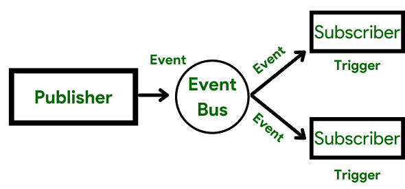

# eventbus

A zero-dependency 100% tested eventbus library written with TypeScript.



## Test / build
```bash
yarn install
# Run tests
npm run test
# Run examples
npm run examples
# Build project
npm run build
```

## Example
```javascript
import {EventBus} from "../src";

const eventBus = new EventBus();
const eventName = "onUserConnected"

//  Simple subscription by event key
eventBus.subscribe(eventName, (...params:any[]) => {
    console.log(`DISPATCH: `, ...params);
});

//  Broadcast values to subscribers
eventBus.dispatch(eventName, "This is event dispatch #1");
eventBus.dispatch(eventName, "This is event dispatch #2");
eventBus.dispatch(eventName, "This is event dispatch #3");

```


## EventBus Methods

### subscribe(eventName, callback)

Subscribe to existing (or not yet) event by `eventName` with a `callback` handler.

### dispatch(eventName, ...values)

Post any data type (string, number, objects...) to all subscribers of provided event by `eventName`

### register(eventName)

Declare a new event by `eventName`

### clear()

Clear whole EventBus (includings subscriptions)
